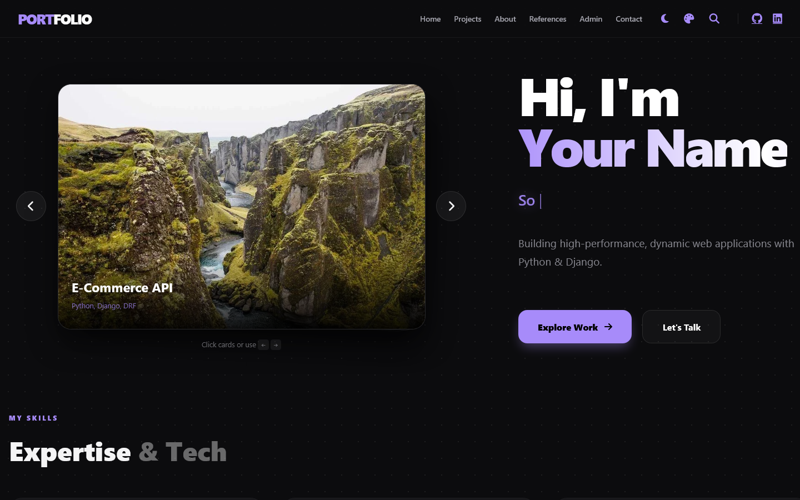
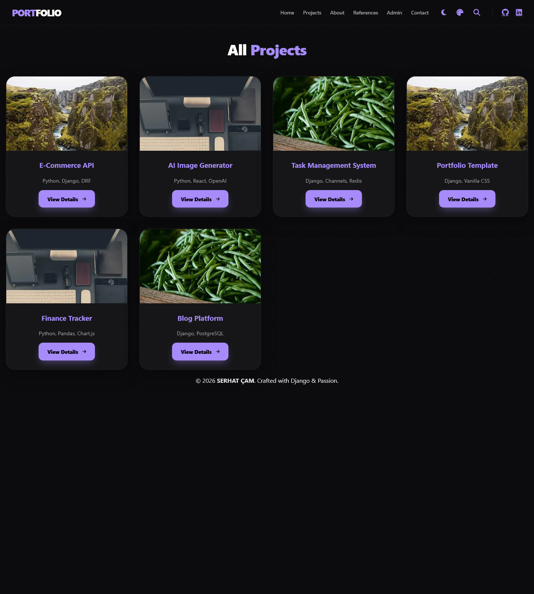
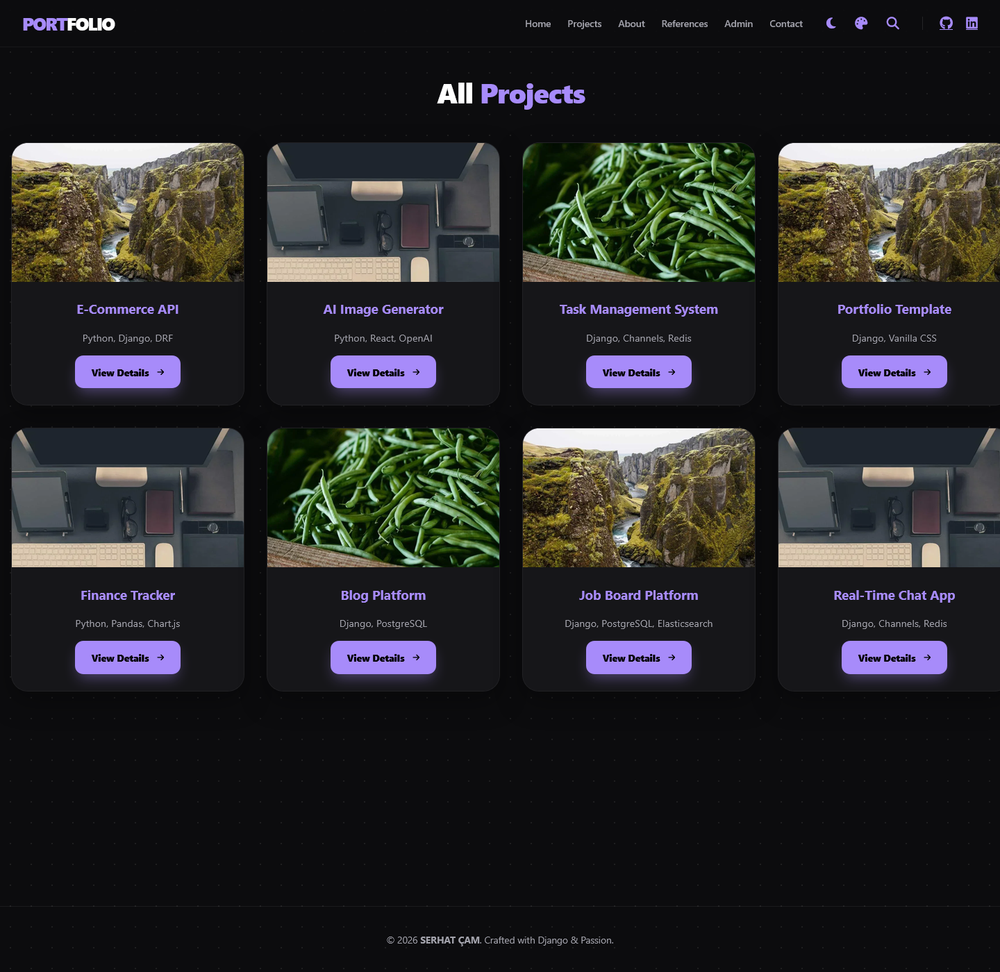
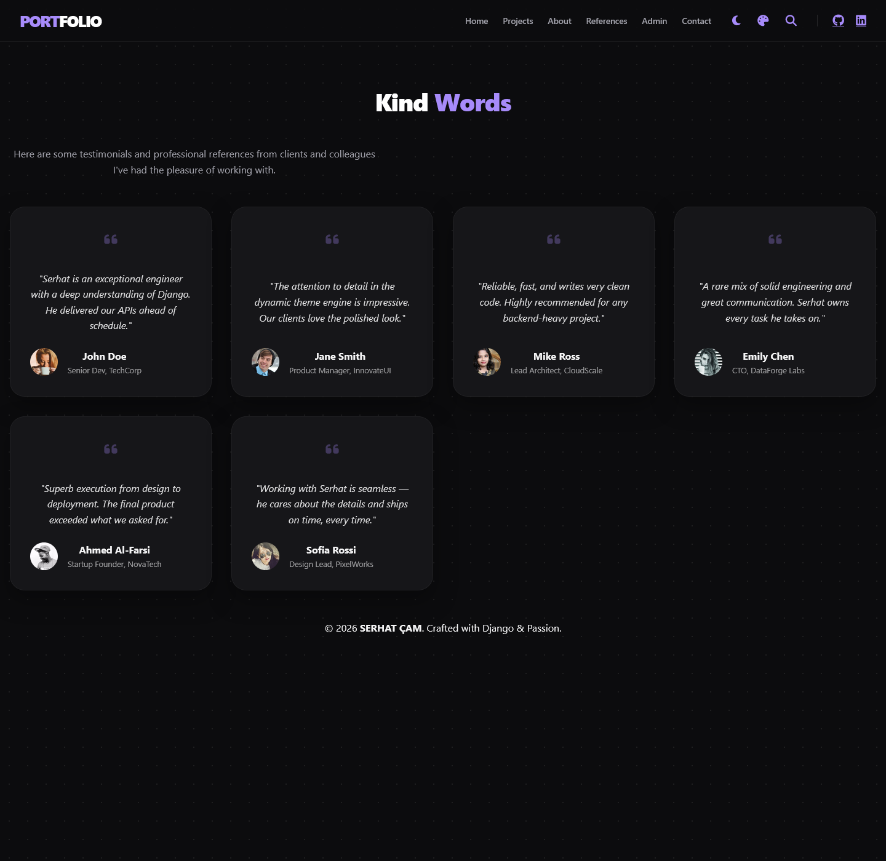
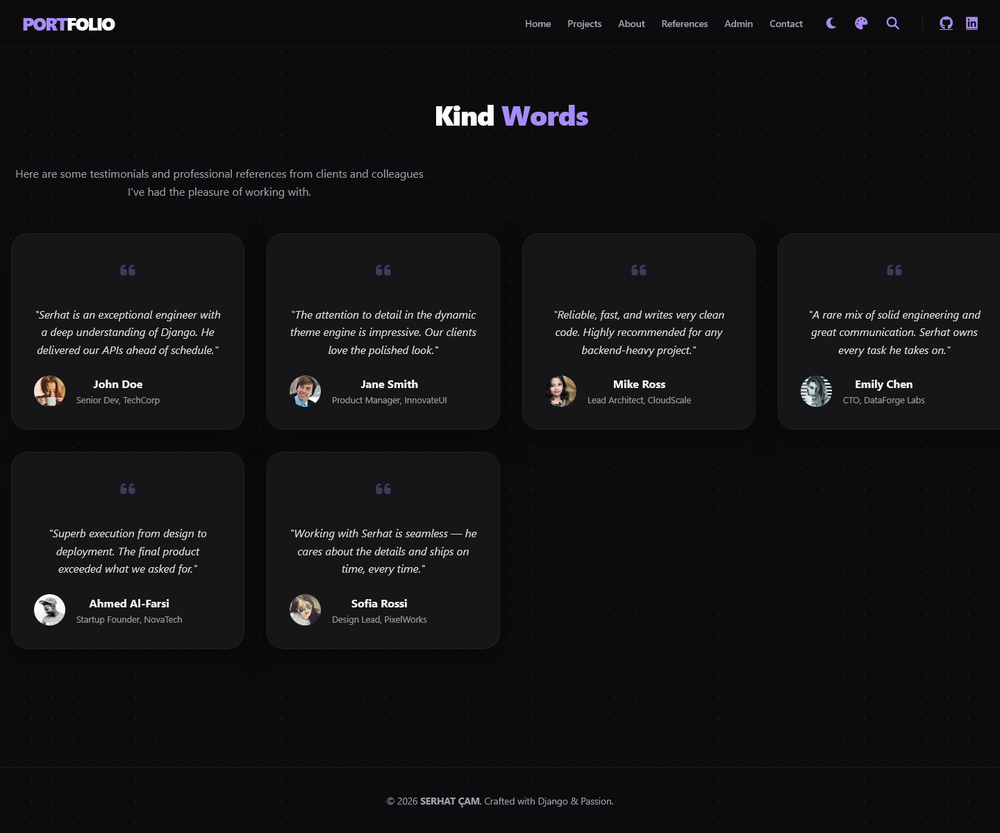
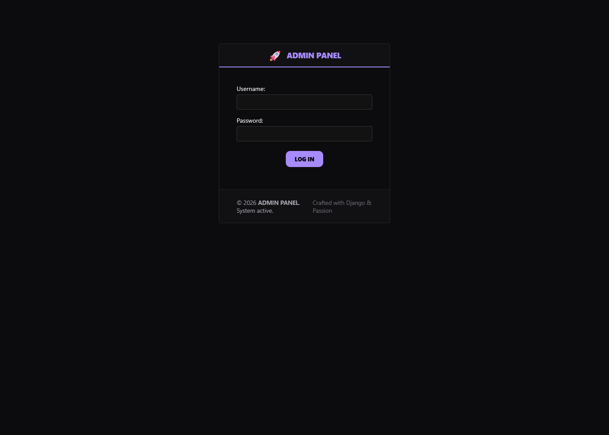
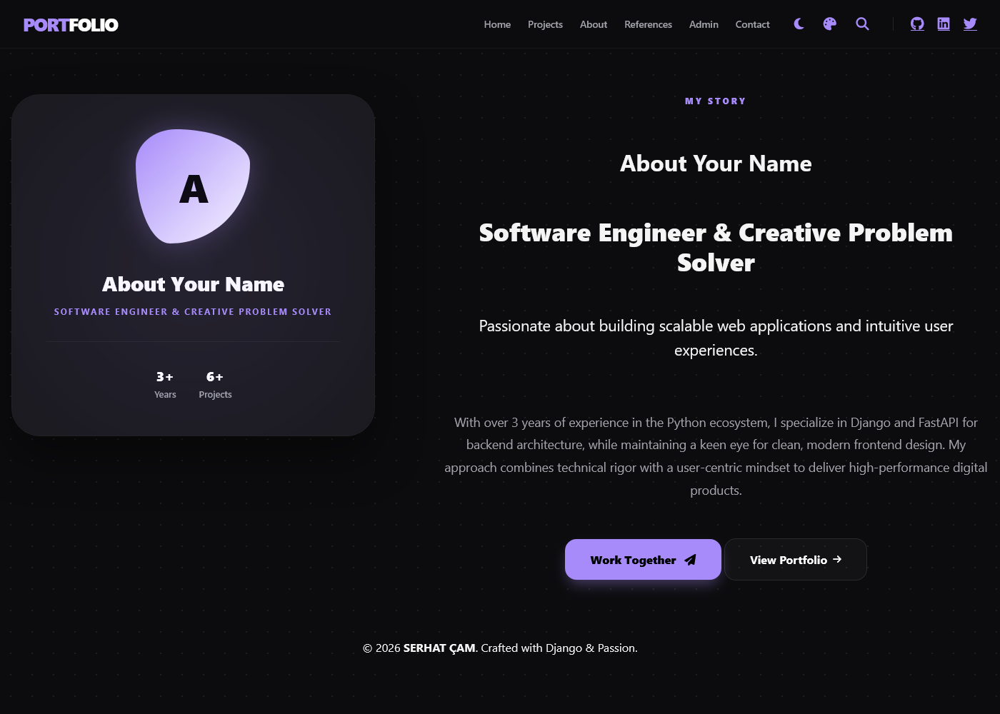
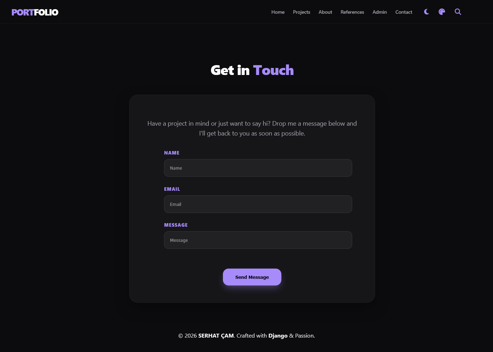
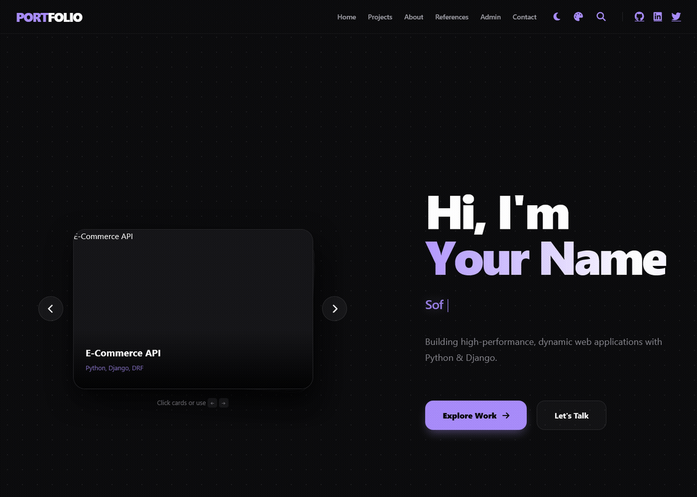

# Django Portfolio

A modern, highly customizable personal **portfolio website** built with **Python / Django**. It ships with an extensive admin panel that gives you full control over branding, themes, global layout, and content — all without touching code.

Fully containerized with **Docker** so you can run it (demo content included) in a single command.

**🔗 Live demo:** https://serhatcamm.github.io/Django-portfolio/

## ✨ Features

- **Dynamic Theme Management** — switch between built-in color schemes (Modern Dark, Midnight Deep, Emerald Forest, Soft Rose) or create your own from the admin.
- **Global Layout Control** — adjust spacing, container widths, grid column widths, gaps, animation speeds, and more globally from the admin panel.
- **Admin-Driven Content** — manage your bio, hero, projects, skills, stats, references, social links, and contact info directly in Django Admin.
- **Light / Dark Mode** — instant theme toggle with per-theme light & dark palettes.
- **Dockerized** — self-contained image with auto-migrate, collectstatic, demo content seeding, and an admin superuser, running as an unprivileged user.
- **Static Export** — export the whole site as a static build for GitHub Pages or any static host.

---

## 🚀 How to run with Docker (recommended)

No Python/venv setup needed — just Docker.

### 1. Clone and configure

```bash
git clone https://github.com/serhatcamm/django-portfolio.git
cd django-portfolio
```

Copy the environment template and generate a real secret key:

```bash
cp .env.example .env        # Windows: copy .env.example .env
python -c "from django.core.management.utils import get_random_secret_key; print(get_random_secret_key())"
# paste the printed value into .env as DJANGO_SECRET_KEY
```

### 2. Build and start

```bash
docker compose up --build
```

The image automatically runs **migrations → collectstatic → seeds demo content → creates the admin superuser**, then starts Gunicorn.

Open **http://localhost:8000** — the site comes pre-seeded with demo content (**8 projects, 6 references**).

**Admin panel:** http://localhost:8000/admin
- Username: `admin`
- Password: `admin123` (**change this before any public deployment**)

> The container **refuses to start** without a real `DJANGO_SECRET_KEY` when DEBUG is off (see the security notes below).

### 3. Everyday Docker commands

| Task | Command |
| --- | --- |
| Start | `docker compose up -d` |
| Stop | `docker compose stop` |
| Restart | `docker compose restart` |
| View logs | `docker compose logs -f` |
| Rebuild after code changes | `docker compose up --build` |
| Full reset (new DB) | `docker compose down -v && docker compose up --build` |

### Environment variables (`.env`)

All settings live in `.env` (see `.env.example`):

| Variable | Default | Purpose |
| --- | --- | --- |
| `DJANGO_DEBUG` | `False` | Debug mode — keep off in production |
| `DJANGO_SECRET_KEY` | *(required)* | Django secret key; required when DEBUG is off |
| `DJANGO_ALLOWED_HOSTS` | `127.0.0.1,localhost,0.0.0.0` | Allowed hosts |
| `DJANGO_SUPERUSER_USERNAME` | `admin` | Auto-created admin username |
| `DJANGO_SUPERUSER_PASSWORD` | `admin123` | Auto-created admin password |
| `DJANGO_SUPERUSER_EMAIL` | `admin@example.com` | Auto-created admin email |

---

## 🐍 How to run locally (without Docker)

Requires **Python 3.12+** (Django 6.x).

```bash
python -m venv venv
# Windows
.\venv\Scripts\activate
# macOS / Linux
source venv/bin/activate

pip install -r requirements.txt
python manage.py migrate
python manage.py seed_demo        # optional: load demo content
python manage.py runserver
```

- Site: http://127.0.0.1:8000
- Admin: http://127.0.0.1:8000/admin

To create your own admin user instead of the seeded one:

```bash
python manage.py createsuperuser
```

---

## 📁 Project Structure (current)

```
manage.py                # Django CLI entry point
requirements.txt         # Python dependencies (incl. whitenoise, gunicorn)
.env.example             # environment variable template (copy to .env)
.gitignore               # ignores .env, venv/, media/, static/, docs output, .agents/
Dockerfile               # container image (non-root app user)
docker-compose.yml       # one-command run + named volume for the DB
docker-entrypoint.sh     # migrate + collectstatic + seed + superuser, then serve
generate_static.py       # static export tool for GitHub Pages

portfolio/               # Django project package (settings, urls, wsgi/asgi)
projects/                # main app: projects, hero, about, skills, stats, themes, refs
projects/management/commands/seed_demo.py  # idempotent demo-content seeder
pages/                   # page views + base context
contact/                 # contact form + messages API
templates/               # HTML templates (base, pages, projects, contact)
staticfiles/             # source static assets (theme.css, logo, favicon)
static/                  # STATIC_ROOT — collectstatic output (gitignored, regenerated)
seed_media/              # demo images copied to media/ when seeding (gitignored)
media/                   # user-uploaded content (gitignored)
docs/                    # generated static export for GitHub Pages (committed)
.agents/skills/          # local agent skills (gitignored)
```

---

## 📸 How to deploy a static live demo (GitHub Pages)

The `docs/` folder is the static export served by GitHub Pages at:
**https://serhatcamm.github.io/Django-portfolio/**

### Regenerate `docs/` after content/layout changes

1. Make sure Django is running locally on port 8000:

   ```bash
   python manage.py migrate
   python manage.py seed_demo
   python manage.py runserver 127.0.0.1:8000
   ```

2. In a second terminal, collect static files, then export:

   ```bash
   python manage.py collectstatic --noinput
   python generate_static.py
   ```

   `generate_static.py` fetches every page from the running server, rewrites links to use the `/Django-portfolio/` base path, and writes the site into `docs/`.

3. Commit and push the `docs/` changes.

### Enable GitHub Pages (one-time)

1. Push this repository to GitHub (branch `main`).
2. Go to **Settings → Pages**.
3. Under **Build and deployment → Source**, choose **Deploy from a branch**.
4. Select branch `main` and folder `/docs`, then **Save**.

> GitHub Pages requires the project name to match the `BASE_PATH` in `generate_static.py` (currently `/Django-portfolio/`, matching the repo name). If you rename the repo, update `BASE_PATH` and regenerate.

---

## 🔒 Security Notes

- **`DJANGO_SECRET_KEY` is required when DEBUG is off.** In development (DEBUG on) a random key is generated automatically; in production the app fails fast if no real key is set — there is **no hardcoded fallback**.
- Docker runs with **`DJANGO_DEBUG=False`** by default, as an unprivileged (non-root) user.
- Static files are served by **WhiteNoise**; user-uploaded media is served by Django for this self-contained deployment. For high-traffic public hosting, front it with Nginx/Caddy.
- Change the default admin password (`admin123`) before any public deployment.
- Enable `ENVIRONMENT=production` (plus HTTPS/TLS) to turn on `SECURE_SSL_REDIRECT`, HSTS, and secure cookies.

---

## 📸 Screenshots

### Home



### Projects




### References




### Admin Panel




### About & Contact






---

## ✅ How to manage content (admin panel)

Manage every part of the site from **http://localhost:8000/admin** without code:

- **Hero Content** — greeting, name, cycling titles, bio, CTA buttons
- **About Content** — title, subtitle, summary, biography, photo, years of experience
- **Projects** — title, description, technology, image, link (shown on the homepage slider + projects grid)
- **Skills** — categorized skill tags
- **Stats** — animated counters (projects, clients, experience)
- **References** — testimonials with author/company
- **Social Links** — GitHub, LinkedIn, etc. (shown in the navbar)
- **Theme Settings** — full color/branding/layout/animation control
- **Site Configuration** — nav labels, footer, section titles, column widths, contact info

Quick recipe to add a project:

1. Go to **Projects → Add project**.
2. Fill in title, slug, description, technology, and link.
3. Upload an image — it is stored under `media/` and served automatically.
4. **Save** — the project appears on the homepage slider and the `/projects/` page.

---

## 📄 License

See the [LICENSE](LICENSE) file.